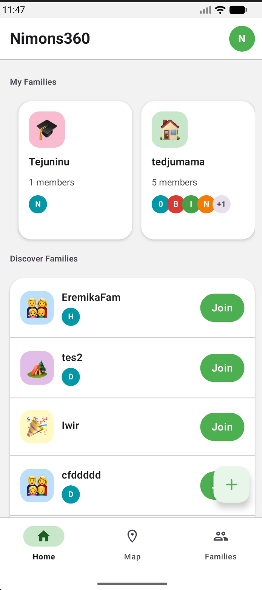
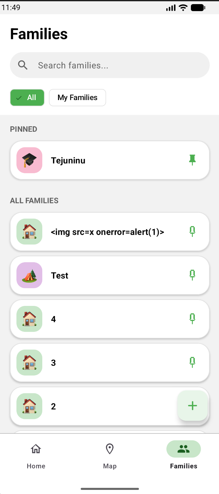
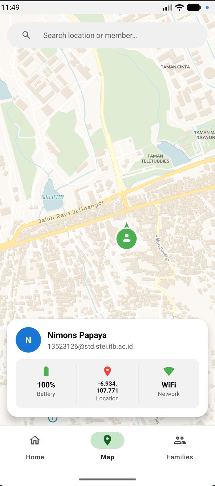
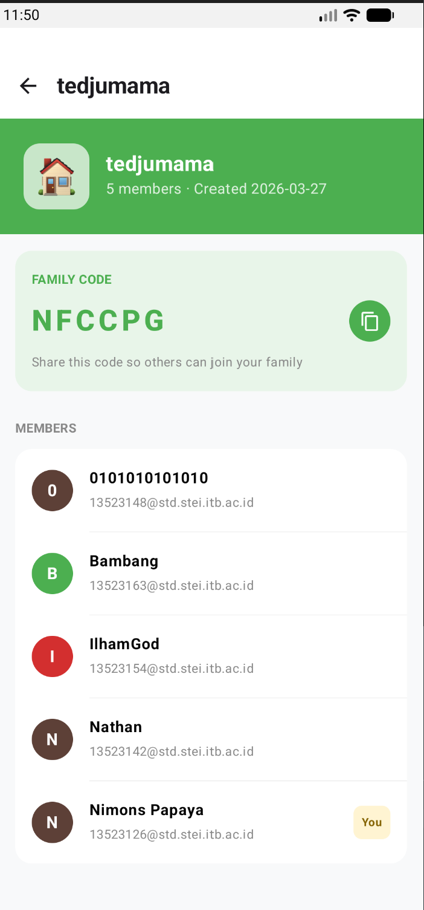

<div align="center">
   
</div>

<div align="center">
   

   <br/><br/>

   
   
   
   
   
   

</div>

---

## About

**Nimons360** is a real-time family location tracking Android app. It lets users create or join family groups, then see every member's live position on an interactive map, complete with battery level, network status, and compass heading broadcast in real time over WebSocket. Think of it as a private, family-first live location hub.

---

## Features

- **Real-Time Location Sharing**
  GPS position is streamed continuously over WebSocket. Markers on the map update live, rotate with the device compass, and are automatically removed when a member goes offline.

- **Family Group Management**
  Create a family group and receive an auto-generated invite code. Share the code so others can join. Leave at any time. Discover public families and request to join.

- **Pinned Families**
  Pin frequently visited families to the top of your list. Pins are stored locally and persist across sessions.

- **Device Status Broadcasting**
  Each presence update includes battery level, charging state, and network type (WiFi / Mobile), visible to all family members on the map.

- **Interactive Map**
  Powered by MapLibre with a clean Carto Voyager tile style. Tap any marker to open a bottom sheet with the member's full status card.

- **Profile Management**
  View and update your display name and avatar. Avatar initial and color are consistent across all surfaces.

---

## Tech Stack

| Layer | Technology |
|:---|:---|
| Language | Kotlin |
| UI | Jetpack Compose + XML Views (Material 3) |
| Navigation | Jetpack Navigation Component |
| State management | ViewModel + StateFlow |
| Real-time comms | WebSocket (OkHttp) |
| Maps | MapLibre GL Native |
| Image loading | Coil |
| Local storage | SQLite (`SQLiteOpenHelper`) |
| Location | Android FusedLocationProvider |
| Networking | Retrofit + OkHttp |

---

## Screenshots

<div align="center">

| Home | Families | Map | Family Detail |
|:---:|:---:|:---:|:---:|
|  |  |  |  |

</div>

---

## Setup and Run

> **Prerequisites:** Android Studio Hedgehog or later · JDK 11+ · Android SDK 26+

### Clone the repository

```bash
git clone <repo-url>
cd ms1-k03-tit
```

### Open in Android Studio

1. Open **Android Studio**
2. Select **Open**, navigate to the cloned folder
3. Wait for Gradle sync to complete
4. Connect an Android device (API 26+) or start an emulator
5. Click **▶ Run** or press `Shift + F10`

### CLI (Linux / macOS)

```bash
# Start emulator
QT_QPA_PLATFORM=xcb emulator -avd Medium_Phone -gpu off -no-snapshot

# Build and install
./gradlew installDebug

# Launch app
adb shell monkey -p com.tit.nimons360 -c android.intent.category.LAUNCHER 1
```

### Multiple emulators (for testing real-time features)

```bash
QT_QPA_PLATFORM=xcb emulator -avd Medium_Phone  -gpu off -no-snapshot
QT_QPA_PLATFORM=xcb emulator -avd Medium_Phone2 -gpu off -no-snapshot

./gradlew assembleDebug

adb -s emulator-5554 install -r app/build/outputs/apk/debug/app-debug.apk
adb -s emulator-5556 install -r app/build/outputs/apk/debug/app-debug.apk
```

### Code formatting

```bash
./gradlew spotlessApply   # format
./gradlew spotlessCheck   # verify
```

---

## Project Structure

```
Nimons360/
├── app/src/main/
│   ├── java/com/tit/nimonsapp/
│   │   ├── MainActivity.kt              # Root activity, WebSocket lifecycle, nav
│   │   ├── data/
│   │   │   ├── network/                 # Retrofit API, WebSocket manager, DTOs
│   │   │   └── repository/              # Auth, Family, Location, Session, Pinned
│   │   ├── model/                       # SQLite helper, PinnedFamily model
│   │   └── ui/
│   │       ├── auth/                    # Login & register screens
│   │       ├── home/                    # Home screen (Compose)
│   │       │   └── components/          # Header, cards, avatar row
│   │       ├── families/                # Families list (XML + RecyclerView)
│   │       ├── familydetail/            # Family detail (Compose)
│   │       ├── createfamily/            # Create family flow (XML)
│   │       ├── map/                     # Live map + presence (MapLibre)
│   │       │   └── components/          # Custom map marker view
│   │       ├── profile/                 # Profile fragment (XML)
│   │       ├── common/                  # Shared: AvatarView, IconImage,
│   │       │                            #   ButtonView, InputField, BottomSheet
│   │       └── theme/                   # NimonsTheme (Compose color scheme)
│   └── res/
│       ├── layout/                      # XML layouts for all screens
│       ├── values/                      # colors.xml, themes.xml, strings.xml
│       ├── drawable/                    # Icons, shape drawables, selectors
│       └── color/                       # State list color selectors
└── docs/
```

<details>
<summary><strong>Directory Details</strong></summary>
<br/>

| Directory | Description |
|:---|:---|
| `data/network/` | Retrofit interface, OkHttp WebSocket manager, all response/request DTOs |
| `data/repository/` | Business logic, auth token, family CRUD, GPS location, pinned families via SQLite |
| `ui/home/` | Compose-based home with lazy family cards and pull-to-refresh |
| `ui/families/` | XML families list with search, chip filter, and RecyclerView adapter |
| `ui/map/` | MapLibre fragment with real-time markers, offline detection, and floating status card |
| `ui/common/` | Reusable Views (`AvatarView`, `ButtonView`, `InputFieldView`) and Compose composables (`iconImage`, `sectionTitle`) |
| `ui/theme/` | `NimonsTheme.kt`, custom Compose `MaterialTheme` with full green scheme overriding M3 defaults |

</details>

---

## Authors

<div align="center">

| NIM | Name |
|:---:|:---|
| 13523126 | Brian Ricardo Tamin |
| 13523142 | Nathanael Rachmat |
| 13523148 | Andrew Tedjapratama |
| 13523154 | Theo Kurniady |

</div>

---

<div align="center">
   
</div>
